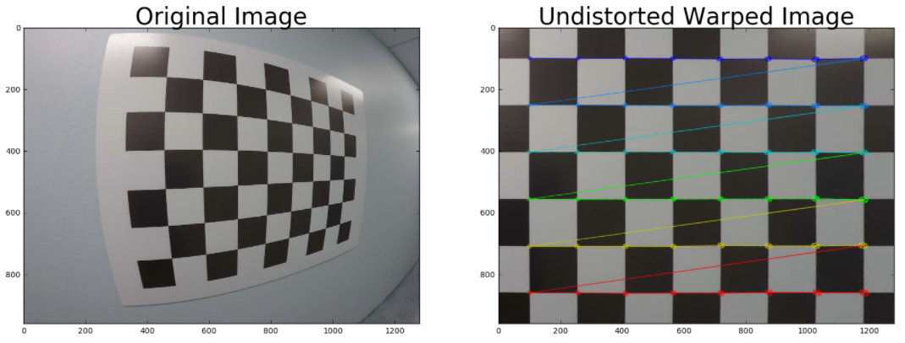

# Quiz Solution: Undistort and Transform

Here's a tricky quiz for you! You have seen how to find corners, calibrate your camera, undistort an image and apply a perspective transform. Now you will perform all these steps on an image. In the last quiz, you calibrated the camera, so here I am giving you the camera matrix, `mtx` and the distortion coefficients `dist` to start with.

Your goal is to generate output like the image shown above. To do that, you need to write a function that takes your distorted image as input and completes the following steps:

- Undistort the image using `cv2.undistort()` with `mtx` and `dist`
- Convert to grayscale
- Find the chessboard corners
- Draw corners
- Define 4 source points (the outer 4 corners detected in the chessboard pattern)
- Define 4 destination points (must be listed in the same order as src points!)
- Use `cv2.getPerspectiveTransform()` to get `M`, the transform matrix
- Use `cv2.warpPerspective()` to apply `M` and warp your image to a top-down view

> **HINT**: source points are the x and y pixel values of any four corners on your chessboard, you can extract these from the `corners` array output from `cv2.findChessboardCorners()`. Your destination points are the x and y pixel values of where you want those four corners to be mapped to in the output image.

If you run into any errors running your code, refer back to examples in _Calibrating Your Camera_ section. To run the code on your own computer, download the [distortion pickle file](../../pickle/wide_dist_pickle.p) and [test image](../../images/test-image2.png) file.

~~~python
import pickle
import cv2
import numpy as np
import matplotlib.pyplot as plt
import matplotlib.image as mpimg

# Read in the saved camera matrix and distortion coefficients
# These are the arrays you calculated using cv2.calibrateCamera()
dist_pickle = pickle.load( open( "wide_dist_pickle.p", "rb" ) )
mtx = dist_pickle["mtx"]
dist = dist_pickle["dist"]

# Read in an image
img = cv2.imread('test_image2.png')
nx = 8 # the number of inside corners in x
ny = 6 # the number of inside corners in y

# MODIFY THIS FUNCTION TO GENERATE OUTPUT 
# THAT LOOKS LIKE THE IMAGE ABOVE
def corners_unwarp(img, nx, ny, mtx, dist):
    # Write code to do the following steps
    # 1) Undistort using mtx and dist
    undist_img = cv2.undistort(img, mtx, dist, None, mtx)
    # 2) Convert to grayscale
    gray = cv2.cvtColor(undist_img, cv2.COLOR_BGR2GRAY)
    # 3) Find the chessboard corners
    ret, corners = cv2.findChessboardCorners(gray, (nx, ny), None)
    # 4) If corners found: 
    if ret == True:
        # Pass in your image into this function
        imshape = (gray.shape[1], gray.shape[0])
        # a) draw corners
        cv2.drawChessboardCorners(undist_img, (nx, ny), corners, ret)
        # b) define 4 source points src = np.float32([[,],[,],[,],[,]])
        offset = 100
        #src = np.float32([[480,780],[480,180],[1020,240],[1020,760]])
        src = np.float32([corners[0], corners[nx-1], corners[-1], corners[-nx]])
                 #Note: you could pick any four of the detected corners 
                 # as long as those four corners define a rectangle
                 #One especially smart way to do this would be to use four well-chosen
                 # corners that were automatically detected during the undistortion steps
                 #We recommend using the automatic detection of corners in your code
        
            # c) define 4 destination points dst = np.float32([[,],[,],[,],[,]])
        #dst = np.float32([[100,900],[150,100],[1180,60],[1200,1100]])
        dst = np.float32([[offset, offset], [imshape[0]-offset, offset], 
        [imshape[0]-offset, imshape[1]-offset], [offset, imshape[1]-offset]])
            # d) use cv2.getPerspectiveTransform() to get M, the transform matrix
        M = cv2.getPerspectiveTransform(src, dst)        
            # e) use cv2.warpPerspective() to warp your image to a top-down view
        warped = cv2.warpPerspective(undist_img, M, imshape)
    #delete the next two lines
    return warped, M

top_down, perspective_M = corners_unwarp(img, nx, ny, mtx, dist)
f, (ax1, ax2) = plt.subplots(1, 2, figsize=(24, 9))
f.tight_layout()
ax1.imshow(img)
ax1.set_title('Original Image', fontsize=50)
ax2.imshow(top_down)
ax2.set_title('Undistorted and Warped Image', fontsize=50)
plt.subplots_adjust(left=0., right=1, top=0.9, bottom=0.)
~~~

## Solution Explained

First off, we defined a function for you, `corners_unwarp()`. The function accepts an image and our previously calculated values for the camera matrix `mtx` and distortion coefficients `dist`.

Then you had to implement the function:

~~~python
# Define a function that takes an image, number of x and y points, 
# camera matrix and distortion coefficients
def corners_unwarp(img, nx, ny, mtx, dist):
    # Use the OpenCV undistort() function to remove distortion
    undist = cv2.undistort(img, mtx, dist, None, mtx)
    # Convert undistorted image to grayscale
    gray = cv2.cvtColor(undist, cv2.COLOR_BGR2GRAY)
    # Search for corners in the grayscaled image
    ret, corners = cv2.findChessboardCorners(gray, (nx, ny), None)

    if ret == True:
        # If we found corners, draw them! (just for fun)
        cv2.drawChessboardCorners(undist, (nx, ny), corners, ret)
        # Choose offset from image corners to plot detected corners
        # This should be chosen to present the result at the proper aspect ratio
        # My choice of 100 pixels is not exact, but close enough for our purpose here
        offset = 100 # offset for dst points
        # Grab the image shape
        img_size = (gray.shape[1], gray.shape[0])

        # For source points I'm grabbing the outer four detected corners
        src = np.float32([corners[0], corners[nx-1], corners[-1], corners[-nx]])
        # For destination points, I'm arbitrarily choosing some points to be
        # a nice fit for displaying our warped result 
        # again, not exact, but close enough for our purposes
        dst = np.float32([[offset, offset], [img_size[0]-offset, offset], 
                                     [img_size[0]-offset, img_size[1]-offset], 
                                     [offset, img_size[1]-offset]])
        # Given src and dst points, calculate the perspective transform matrix
        M = cv2.getPerspectiveTransform(src, dst)
        # Warp the image using OpenCV warpPerspective()
        warped = cv2.warpPerspective(undist, M, img_size)

    # Return the resulting image and matrix
    return warped, M
~~~