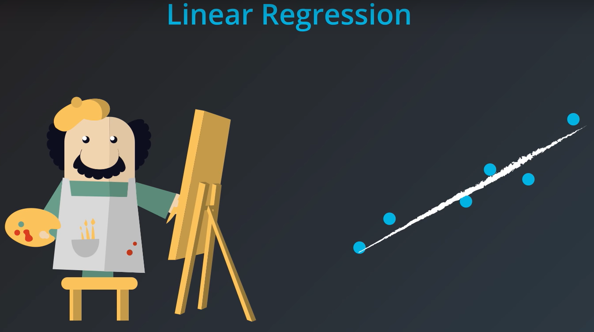
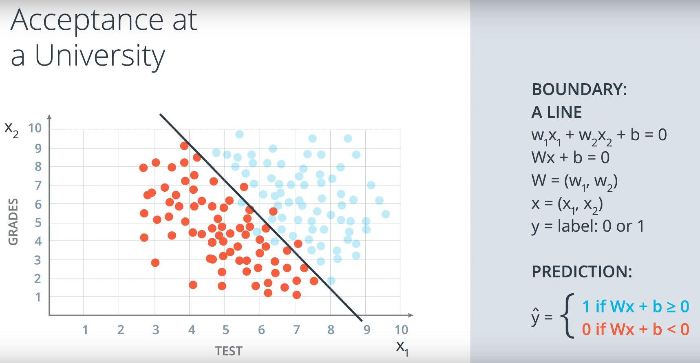
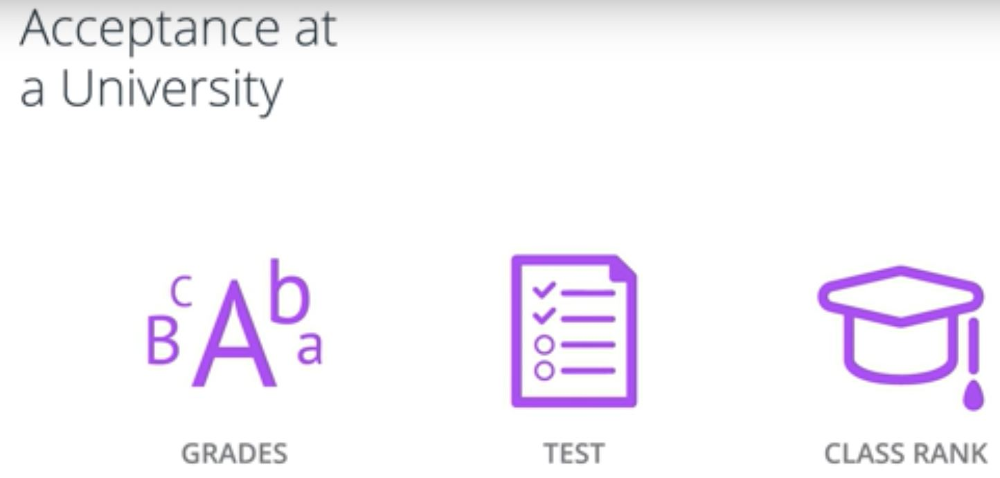
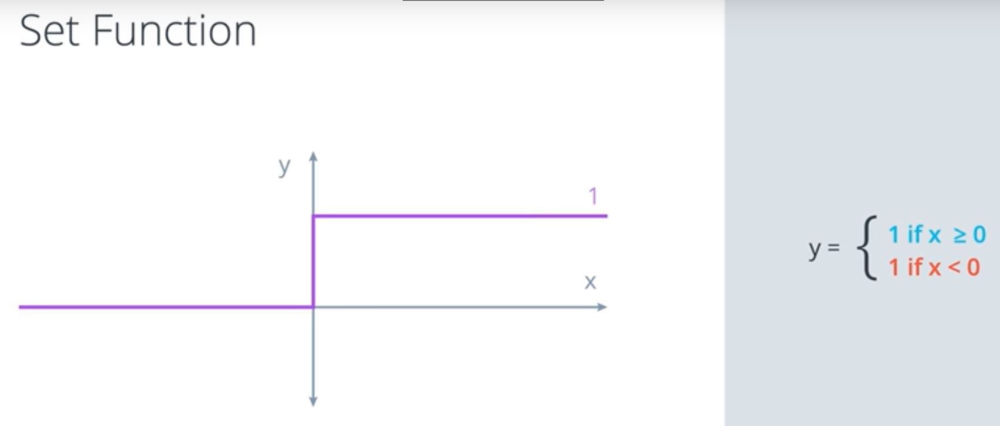
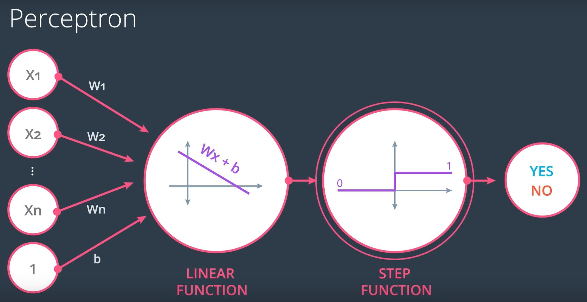
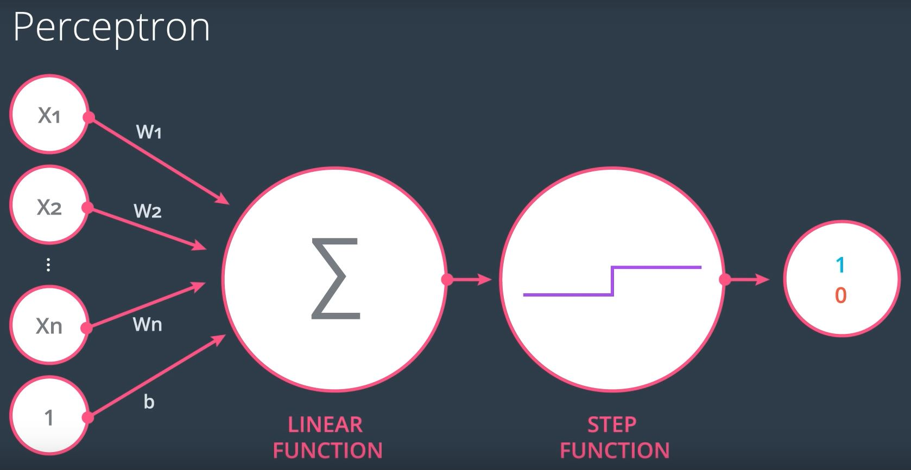
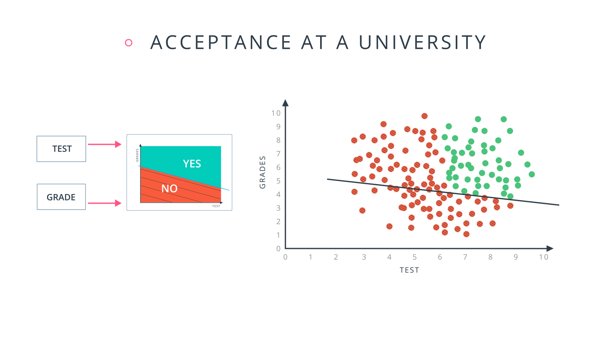
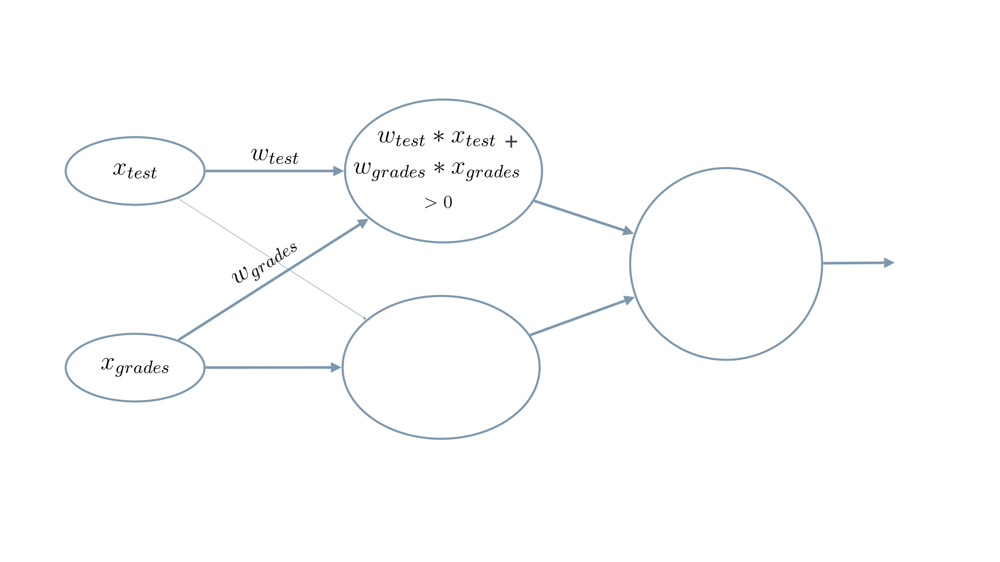
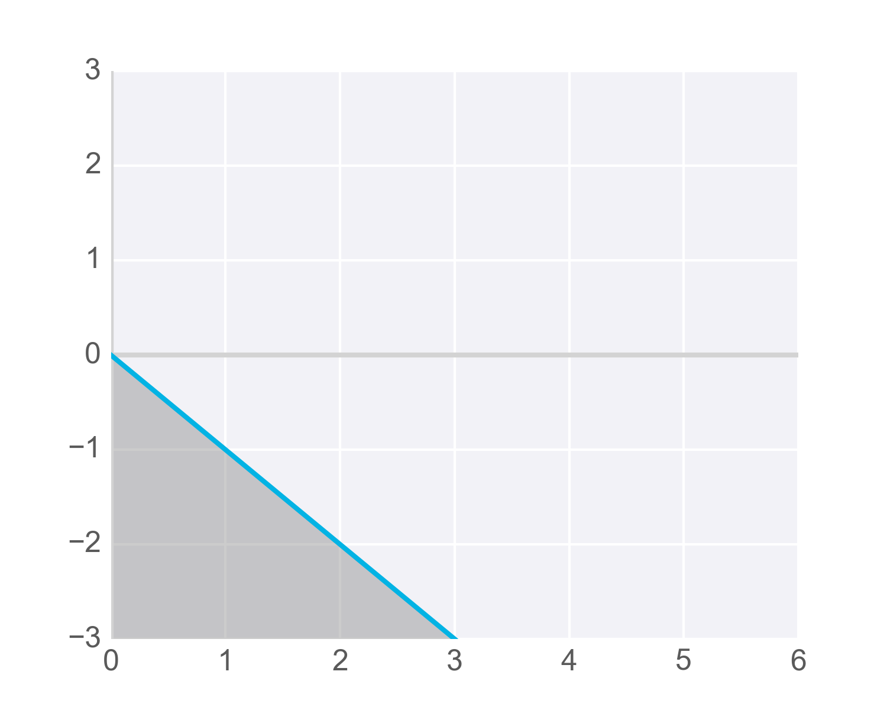

# Neural Networks

Build and train neural networks from linear and logistic regression to backpropagation and multilayer perceptron networks.

## Neural Network Intuition

Perhaps the hottest topic right now is Artificial Intelligence and when people talk about this, they usually mean Machine Learning, specifically neural networks.

Neural networks should be familiar to you, a big neural network is your brain, which has 10 to the 11 neurons. What people have done in the last decades kind of abstracted this big mass in your brain into a basis of equations that emulate a network of artificial neurons. Then people have invented ways to train these systems based on data. So, rather than instructing a machine with rules like a piece of software, these neural networks are trained based on data.

So, you're going to learn the basics now: perceptron, backpropagation, terminology that doesn't make sense yet, but by the end of this unit you should be able to write and code and train your own neural network.

## Introduction to Deep Learning

Here you're going to learn one of the most exciting tools in self-driving car development, deep neural networks. At the end of this module, you'll create a project that demonstrates real world application of the skills you need to become a self-driving car engineer.

In the project, you'll train a deep neural network to drive a car in a simulator. First you'll drive and record training laps in simulation and then you'll build and train a deep neural network that learns from the way you drive.

A deep neural network is just a term that describes a big multi-layer neural network. A neural network is a machine learning algorithm that you can train using input like camera images or sensor readings and generate output like what the steering angle the car should take or how fast it should go. The idea is the neural network learns from observing the world. You don't have to teach it anything specific.

Deep learning is just another term for using deep neural networks to problems and it's become really important for self-driving cars. But deep learning is relatively new, until the last few years, computers simply weren't fast enough to train deep neural networks effectively. Now however, automotive manufacturers can apply deep learning techniques to drive cars in real time.

Because deep learning is so new, automotive engineers and researchers are still experimenting with just how far it can take us, but deep learning has already revolutionized segments of autonomous driving like computer vision and it has the potential to entirely change the way we develop self-driving cars.

## Starting Machine Learning

Some of the most recent breakthroughs in the performance of self-driving cars have come from machine learning. Two of my Udacity colleagues: Luis and Mat are machine learning experts. In this lesson, they are going to introduce you to the foundational concepts in the fields of machine learning and deep neural networks. Afterward, we'll build on those concepts and apply them to self-driving cars.

Luis Serrano leads the Machine Learning Nanodegree program at Udacity. Machine Learning is a field of artificial intelligence that relies on computers to learn about the environment from data instead of relying on the rules set by computer programmers.

Mat Leonard leads the Deep Learning Nanodegree program. Deep learning is an approach to machine learning that uses deep neural networks. Deep learning uses this one tool to accomplish an amazing array of objectives from speech recognition to driving a car.

You'll start learning about the perceptron, which is the fundamental unit of a neural network. Then you'll learn how to combine these units into a simple neural network. Before you start learning about neural networks, let's go over the basics of machine learning.

We'll get started with something less complex than self-driving cars. Housing prices.

## A note on Deep Learning

The following lessons contain introductory and intermediate material on neural networks, building a neural network from scratch, using TensorFlow and Convolutional Neural Networks:

- Neural Networks
- TensorFlow
- Deep Neural Networks
- Convolutional Neural Networks

## Quiz: Housing Prices

Enter the [Housing Prices quiz](quizzes/housing-prices/quiz.md)

You can think of **linear regression** as a painter who will look at your data and draw the best fitting line through it.

## Linear to Logistic Regression

Linear regression helps predict values on a continuous spectrum, like predicting what the price of a house will be.

How about classifying data among discrete classes?

- Determining whether a patient has cancer
- Identifying the species of a fish
- Figuring out who's talking on a conference call

Classification problems are important for self-driving cars. Self-driving cars might need to classify whether an object crossing the road is a car, pedestrian and a bicycle. Or they might need to identify which type of traffic sign is coming up or what a stop light is indicating.

In the next video, Luis will demonstrate a classification algorithm called "logistic regression". He'll use logistic regression to predict whether a student will be accepted to a university.

Linear regression leads to logistic regression and ultimately neural networks, a more advanced classification tool.

## Classification Problems

We'll start by defining what we mean by classification problems and applying it to a simple example.

Enter the [Classification Problems quiz](quizzes/classification/quiz.md)

## Linear Boundaries

Let's add some math. We'll label the horizontal axis corresponding to test with variable X1 and the vertical axis corrsponding to the grades by X2. So, this boundary line that separates the blue and red points is going to have a linear equation.

**Boundary A Line**:

~~~
2X1 - X2 - 18 = 0
~~~

What does this equation mean?

It means that our method for accepting or rejecting students says the following:

~~~
Score = 2*Test + Grades - 18
~~~

and when a student comes in, we check their score and if there score is a positive number, we accept the student, but if it is a negative number, we reject the student. This is called a prediction:

**Prediction**:

~~~
Score > 0: Accept
Score < 0: Reject
~~~

That is it. That linear equation is our model.

In a more general case, our boundary will be in the form:

**General Boundary A Line**:

~~~
w1x1 + w2x2 + b = 0
~~~

We will abbreviate this equation in vector notation as 

~~~
Wx + b = 0
~~~

where W is the vector w1 and w2 and x is the vector x1 and x2:

~~~
W = (w1, w2)
x = (x1, x2)
~~~

and we simply take the product of the two vectors. We will refer to **x** as the input and **W** as the weights and **b** as the bias. Now for student coordinates x1 and x2, we will denote the label as y and the label is what we are trying to predict. So if the student gets accepted (mainly the point is blue), then the label is `y = 1` and if the student gets rejected (mainly the point is red), then the label is `y = 0`:

~~~
y = label: 0 or 1
~~~

Finally, our prediction is going to be called y hat and it will be what the algorithm predicts the label will be. In this case, y hat is 1 if the algorithm predicts the student gets accepted, which means the point lies over the line. y hat is 0 if the algorithm that the student get rejected, which means the point is under the line. In math terms, y hat is 1 if `Wx + b >= 0` and y hat is 0 if `Wx + b < 0`.

## Quiz: Linear Boundaries

Enter the [Linear Boundaries quiz](quizzes/linear-boundaries/quiz.md)

## Higher Dimensions

You may be wondering what happens if we have something more than just test and grades like the ranking of the student in the class? How do we fit 3 columns of data? Now the only difference is that we won't be working in 2 dimensions, now we will be working in 3 dimensions.

So, now we have 3 axis: X1 for the test, X2 for the grades and X3 for the class ranking. Our data will look like the following:

A bunch of blue and red points flying around in 3D and our equation won't be a line in 2 dimensions, but a plane in 3 dimensions. The equation will be similar as before:

**Boundary: A Plane**:

~~~
w1x1 + w2x2 + w3x3 + b = 0
~~~

This equation can still be abbreviated as:

~~~
Wx + b = 0
~~~

except our vectors will now have 3 entries instead of 2 and our prediction will still be y hat equals 1 if `Wx + b >= 0` and y hat equals 0 if `Wx + b < 0`.

What if we have many columns like n of them? Well it is the same thing, now our data just lives in **n-dimensional space**. 

~~~
x1, x2,...,xn
~~~

It can be difficult to picture things in more than 3 dimensions, but if we can imagine that the points are things with just n coordinates called x1, x2, x3 all the way up to xn with our labels being y, then our boundary is just a n-1 dimensional hyperplane, which is the high dimensional equivalent of a line in 2D or a plane in 3D and the equation of this **n-1 dimensional hyperplane** is:

**Boundary:**

~~~
w1x1 + w2x2 + wnxn + b = 0
~~~

which we can still abbreviate to:

~~~
Wx + b = 0
~~~

where our vectors now have n entries and our prediction are still the same as before. It is y hat equals 1 if `Wx + b >= 0` and y hat equals 0 if `Wx + b < 0`

## Quiz: Higher Dimensions

Ente the [Higher Dimensions quiz](quizzes/higher-dimensions/quiz.md)

## Perceptrons

A **perceptron** is an encoding of our equation into a small graph. 

**Notation 1**:

The first way we build it is the following: we have our data and boundary line and we fit it inside a node and we add small nodes for the inputs, which are test and grades:

and what the perceptron does is plots the point **(7,6)** and checks if the point is in the positive or negative area. 

If the point is in the positive area, then the perceptron returns a yes:

If the point is in the negative area, then the perceptron returns a no.

Let's recall our equation `score = 2*Test + 1*Grades - 18` and that our prediction consists of accepting the student if our score is positive or 0 and rejecting them if the score is negative. These weights `2, 1, -18` are what define the linear equation and we will use them as labels in the graph. The `2` and the `1` will label the edges coming from x1 and x2 respectively and the bias unit `-18` will label the node. Thus, when we see a node with these labels, we can think of the linear equation they generate.

**Notation 2**:

Another way to grab this node is to consider the bias as part of the input. Now since **W1** gets multiplied by **x1** and **W2** by **x2**, it is natural to think that **b** gets multiplied by **1**. So, we will have a **b** labeling an edge coming from a **1**. Then what the node does is it multiplies the values coming from the incoming nodes by the values and the corresponding edges. Then it adds them and checks if the result is greater than or equal to 0. If the result is, then the node returns a yes or value of 1 and if it isn't, then the node returns a no or a value of 0.

We will be using both notations throughout this course. Although the second one will be used more often. In the general case, this is how the nodes look: we will have our **node** to the right and our inputs on the left going into the node with values **x1** up to **xn** and **1** and edges with weights **W1** up to **Wn** and **b** corresponding to the bias unit. Then the node calculates the linear equation `Wx + b`, which is the summation from `i = 1` to **n** of `WiXi + b`. This node then checks if the value is 0 or bigger and if it is, then the node returns a value of one for yes and if not, then it returns a value of 0 for no.

Know that we are using an implicit function called a **step function**, which returns a 1 if the input is positive or 0 and it returns 0 if the input is negative.

**step function**:

~~~
y = 1 if x >= 0
y = 0 if x < 0
~~~

So in reality, these perceptrons can be seen as a combination of nodes where the first node calculates the linear equation on the inputs on the weights

and the second node applies the step function to the result

This can be graphed as follows: the summation sign represents the linear function in the first node and the drawing represents the step function in the second node.

In the future, we will use different step functions, so this is why it is useful to specify it in the node.

So as we have seen, there are two ways to represent perceptrons: the one on the left has a bias unit coming from an input node with a value of 1 and the one on the right has the bias inside the node.

## Quiz: Perceptrons

Enter the [Perceptrons quiz](quizzes/perceptrons/quiz.md)

## Perceptrons II

### Perceptron

Now you've seen how a simple neural network makes decisions: by takinng in input data, processing that information and finally producing an output in the form of a decision!

Let's take a deeper dive into the university admission example to learn more about processing the input data.

Data, like test scores and grades are fed into a network of interconnected nodes. These individual nodes are called [perceptrons](https://en.wikipedia.org/wiki/Perceptron), or artificial neurons, and they are the basic unit of a neural network. Each one looks at input data and decides how to categorize that data. In the example above, the input either passes a threshold for grades and test scores or doesn't, and so the two categories are: yes (passed the threshold) and no (didn't pass the threshold). These categories then combine to form a decision -- for example, if both nodes produce a "yes" output, then this student gains admission into the university.

Let's zoom in even further and look at how a single perceptron processes input data.

The perceptron above is one of the two perceptrons from the video that help determine whether or not a student is accepted to a university. It decides whether a student's grades are high enough to be accepted to the university. You might be wondering: "How does it know whether grades or test scores are more important in making this acceptance decision?" Well, when we initialize a neural network, we don't know what information will be most important in making a decision. It's up to the neural network to _learn for itself_ which data is most important and adjust how it considers that data.

It does this with something called **weights**.

### Weights

When input comes into a perceptron, it gets multiplied by a weight value that is assigned to this particular input. For example, the perceptron above has two inputs, `tests` for test scores and `grades`, so it has two associated weights that can be adjusted individually. These weights start out as random values, and as the neural network learns more about what kind of input data leads to a student being accepted into a university, the network adjusts the weights base on any errors in categorization that results from the previous weights. This is called **training** the neural network.

A higher weight means the neural network considers that input more important than other inputs and lower weight means that the data is considered less important. An extreme example would be if test scores had no affect at all on university acceptance; then the weight of the test score input would be zero and it would have no affect on the output of the perceptron.

### Summing the Input Data

Each input to a perceptron has an associated weight that represents its importance. These weights are determined during the learning process of a neural network, called training. In the next step, the weighted input data are summed to produce a single value that will help determine the final output - whether a student is accepted to a university or not. Let's see a concrete example of this:

We weight `x_test` by `w_test` and add it to `x_grades` weighted by `w_grades`.

When writing equations related to neural networks, the weights will always be represented by some type of the letter **w**. It will usually look like a ***W*** when it represents a **matrix** of weights or a _w_ when it represents an **individual** weight, and it may include some additional information in the form of a subscript to specify _which_ weights (you'll see more on that next). But rememberr, when you see the letter **w**, think **weights**.

In this example, we'll use ***w_grades*** for the weight of `grades` and ***w_test*** for the weight of `test`.

For the image above, let's say that the weights are: `w_grades = -1`, `w_test = -0.2`. You don't have to be concerned with the actual values, but their relative values are important. ***w_grades*** is 5 times larger than ***w_test***, which means the neural network considers `grades` input 5 times more important than `test` in determining whether a student will be accepted into a university.

The perceptron applies these weights to the inputs and sums them in a process known as **linear combination**. In our case, this looks like `w_grades * x_grades + w_test * x_test = -1 * x_grades - 0.2 * x_test`.

Now to make our equation less wordy, let's replace the explicit names with numbers. Let's use 1 for ***grades*** and 2 for ***tests***. So now our equation becomes:

~~~
w1*x1 + w2*x2
~~~

In this example, we just have 2 simple inputs: grades and tests. Let's imagine we instead had `m` different inputs and we labeled them `x1,x2,...,xm`. Let's also say that the weight corresponding to x1 is w1 and so on. In that case, we would express the linear combination succintly as:

~~~
summation(m, i=1, w_i * x_i) 
~~~

Here the Greek letter Sigma is used to represent **summation**. It simply means to evaluate the equation to the right multiple times and add up the results. In this case, the equation it will sum is 

~~~
w_i * x_i
~~~

But where do we get w_i and x_i?

The summation above means to iterate over all i values from 1 to m.

So to put summation equation above together:

- Start at i = 1
- Evalute w1 * x1 and remember the results
- Move to i = 2
- Evaluate w2 * x2 and add these results to w1 * x1
- Continue repeating that process until i = m, where m is the number of inputs

### Calculating the Output with an Activation Function

Finally, the result of the perceptron's summation is turned into an output signal! This is done by feeding the linear combination into an **activation function**.

Activation functions are functions that decide, given the inputs into the node, what should be the node's output? Because it's the activation function that decides the actual output, we often refer to the outputs of a layer as its "activations".

One of the simplest activation functions is the **Heaviside step function**. This function returns a **0** if the linear combination is less than 0. It returns a **1** if the linear combination is positive or equal to zero. The [Heaviside step function](https://en.wikipedia.org/wiki/Heaviside_step_function) is shown below, where h is the calculated linear combination:

The Heaviside Step Function

In the university acceptance example above, we used the weights `w_grades = -1, w_test = -0.2`. Since ***w_grades*** and ***w_test*** are negative values, the activation function will only return a 1 if grades and test are 0! This is because the range of values from the linear combination using these weights and inputs are `(−∞,0]` (ex. negative infinity to 0, including 0 itself).

It's easiest to see this with an example in two dimensions. In the following graph, imagine any points along the line or in the shaded area represent all the possible inputs to our node. Also imagine that the value along the y-axis is the result of performing the linear combination on these inputs and the appropriate weights. It's this result that gets passed to the activation function.

Now remember that the step activation function returns 1 for any inputs greater than or equal to zero. As you can see in the image, only one point has a y-value greater than or equal to zero - the point right at the origin (0,0):

Now we certainly want more than one possible grade/test combination to result in acceptance, so we need to adjust the results passed to our activation function so it activates - that is, returns 1 - for more inputs. Specifically, we need to find a way so all the scores we'd like to consider acceptable for admission produce values greater than or equal to zero when linearly combined with the weights into our node.

One way to get our function to return 1 for more inputs is to add a value to the results of our linear combination, called a **bias**.

A bias, represented in equations as _b_, lets us move values in one direction or another.

For example, the following diagram shows the previous hypothetical function with an added bias of +3. The blue shaded area shows all the values that now activate the function. But notice that these are produced with the same inputs as the values shown shaded in grey - just adjusted higher by adding the bias term:

Of course, with neural networks we won't know in advance what values to pick for biases. That's ok because like the weights, the bias can also be updated and changed by the neural network during training. So after adding a bias, we now have a complete perceptron formula:

Perceptron Formula

This formula returns 1 if the input (x1,x2,...,xm) belongs to the accepted-to-university category or returns 0 if it doesn't. The input is made up of one or more [real numbers](https://en.wikipedia.org/wiki/Real_number), each one represented by xi, where m is the number of inputs.

Then the neural network starts to learn! Initially, the weights (_wi_) and bias (_b_) are assigned a random value and then they are updated using a learning algorithm like gradient descent. The weights and biases change so that the next training example is more accurately categorized and patterns in data are "learned" by the neural network.

Now you have a good understanding of perceptrons, let's put that knowledge to use. In the next section, you'll create the AND perceptron from the _Why Neural Networks?_ section by setting the values for weights and bias. 

## Why "Neural Networks"?